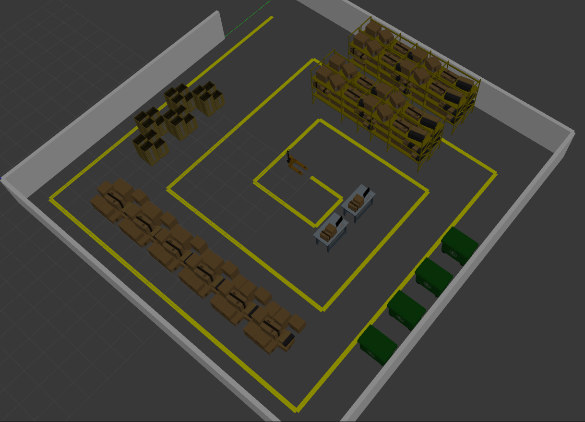
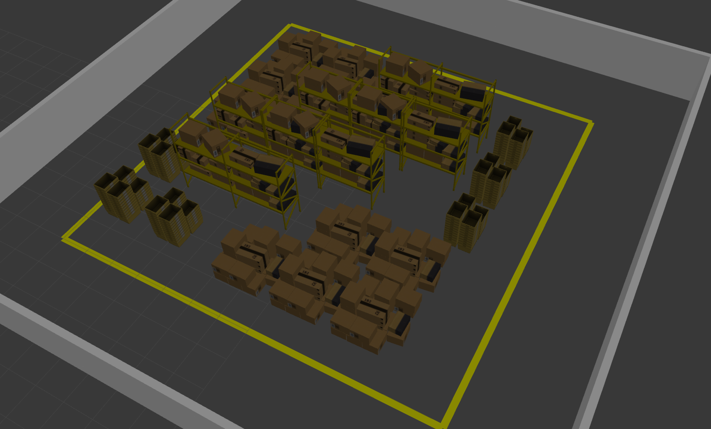
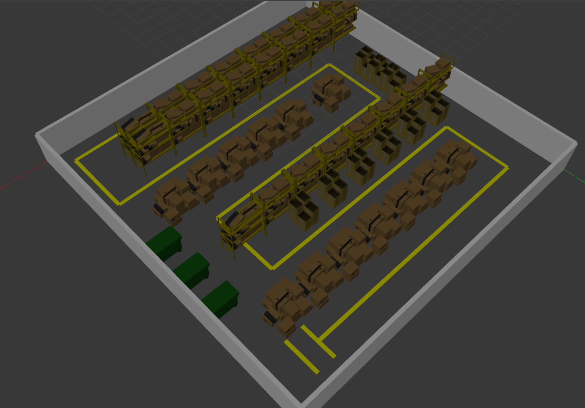
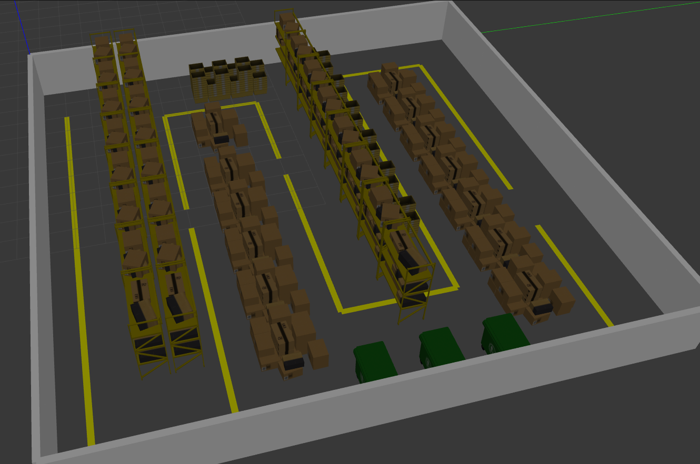

### Generating Worlds

It's possible use these worlds to test a repository aplications and others, these worlds have with base this repository:

```bash
    git clone https://github.com/aws-robotics/aws-robomaker-small-warehouse-world.git
```

The worlds use in this repository was createad automated with this step's:

#### Config world parameter
Include a file in the folder:
```bash
    src/adaptative_localization/param_worlds/
```
The file needs be a *.yaml format. In this should have a matrix that determine a position of walls, paths and models, configure this like you want.

#### Change launch file
In the launch file src/adaptative_localization/launch/generate_world.launch edit to name file to destiny a result world
Edit too a param file in the line:

```bash
    rosparam file="$(find adaptative_localization)/param_worlds/[Your Param File].yaml
```

#### Create a world
Run this comand:

```bash
    roslaunch adaptative_localization generate_world.launch
```

Click in image of worlds default and get a file

<div style="display: flex; flex-wrap: wrap; gap: 10px;">
  <a href="src/adaptative_localization/world/maze_warehouse.world"></a>
  <a href="src/adaptative_localization/world/square_warehouse.world">
  <a href="src/adaptative_localization/world/line_comp_warehouse.world">
  <a href="src/adaptative_localization/world/line_fail_warehouse.world">
</div>