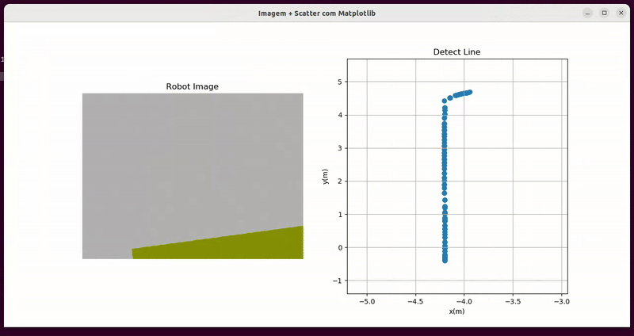

<!-- Project title 
* use a dynamic typing-SvG here https://readme-typing-svg.demolab.com/demo/
*
*  Instead you can type your project name after a # header
-->

<div align="center">

</div>


## About
<!-- 
* information about the project 
* 
* keep it short and sweet
-->


This repository provides a ROS-based solution for AGVs to detect physical lines using onboard cameras.
It processes image data and robot transforms (TF) to identify real-world guidance lines.
From this, a virtual line is generated to serve as a reference for trajectory following.
The system supports multiprocessing for efficient real-time operation.
Designed for industrial environments where visual line tracking is essential for navigation.


## Requireds
<!-- 
* Here you may add information about how 
* 
* and why to use this project.-->

- machine with Ubuntu 20.04 or high
- clone this repository into your local machine.

```bash
    git clone https://github.com/gabrielhvs/AGV-adaptative-localization.git
```


## Demo<!-- Required -->
<!-- 
* You can add a demo here GH supports images/ GIFs/videos 
* 
* It's recommended to use GIFs as they are more dynamic
-->


<div align="center">
    
</div>


<p align="right"><a href="#about">back to top ⬆️</a></p>

## Documentation<!-- Optional -->
<!-- 
* You may add any documentation or Wikis here
-->

Run the main repository:

```
./tools/run_ws.sh
```

To using this package you need of a bag file with camera topic image and TF topics.

```
rosrun gen_virtual_line gen_virtual_line.py "Your bag File"
```

## Feedback<!-- Required -->
<!-- 
* You can add contacts information like your email and social media account 
* 
* Also it's common to add some PR guidance.
-->


> You can make this project better, please  feel free to open a [Pull Request](https://github.com/gabrielhvs/AGV-adaptative-localization/pulls).
- If you notice a bug or a typo use the tag **"Correction"**.
- If you want to share any ideas to help make this project better, use the tag **"Enhancement"**.

<details>
    <summary>Contact Me 📨</summary>

### Contact<!-- Required -->
Reach me via email: [gabbrielvasc@gmail.com](mailto:gabbrielvasc@gmail.com)
<!-- 
* add your email and contact info here
* 
* 
-->
    
</details>

<!-- - Use this html element to create a back to top button. -->
<p align="right"><a href="#about">back to top ⬆️</a></p>
